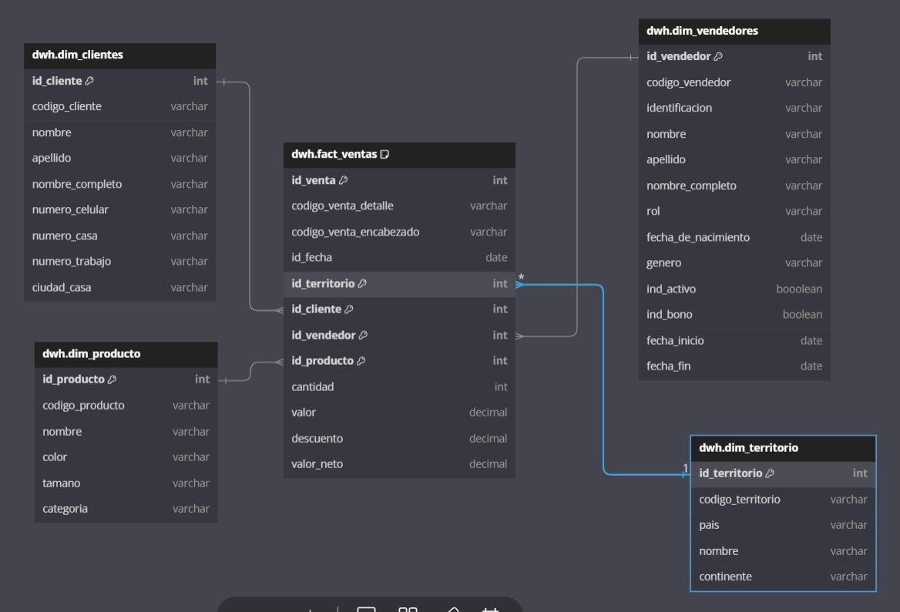

# Data Warehousing Project

## Project Overview

This project demonstrates the implementation of a Data Warehousing solution using PostgreSQL, AWS Redshift, and Pentaho. The objective is to transform transactional data from the AdventureWorks database into a structured Data Warehouse to address key business questions.

## Business Questions

1. **Sales and Discounts by Day and Month:**
   - What are the sales and discounts per day and month?
   - Detailed breakdown of discount quantities and values, as well as total net sales (sales value minus discounts) for each day and month.
2. **Sales Evolution by Vendor in March 2013:**
   - How have net sales per vendor evolved in March 2013?
   - Comparing net sales of each vendor to previous periods.

3. **Top-Selling Product by Category Today:**
   - What is the most sold product in each category based on today's sales?

4. **Top Customer in the Last Year:**
   - Who is the customer with the highest number of purchases in the last year?

## Star Schema Design



The star schema is designed to efficiently answer the above business questions by organizing data into fact and dimension tables.

## Tools and Technologies

- **PostgreSQL:** Transactional database and data source.
- **DBeaver:** Database management tool.
- **Ruby:** Scripting language for data manipulation.
- **Docker:** Containerization for pre-configuration.
- **Amazon Redshift:** Data Warehouse.
- **Amazon S3:** Data storage and tracking.
- **Pentaho:** ETL tool for data extraction, transformation, and loading.

## Folder Structure

- `Jobs/`  
  Contains Pentaho job files for ETL processes.
  
- `Transformations/`  
  Holds Pentaho transformation files.
  
- `Transformation Parameters/`  
  Stores parameter configurations for transformations.
  
- `SQL Scripts/`  
  Includes SQL scripts for:
  - Dimensional model design (`Dimensional Model Design - dbdiagram.sql`)
  - Physical model creation (`Fisical Model dwh_adventureworks.sql`)
  - Data extraction (`extraction clientes.sql`)

## How the Project Works

1. **Data Extraction:** Extract data from the AdventureWorks PostgreSQL database.
2. **Data Transformation:** Use Pentaho to perform ETL processes, creating dimensions (Type 1, 2, 3) and fact tables.
3. **Data Loading:** Load the transformed data into AWS Redshift and store backups in Amazon S3.
4. **Automation:** Implement automated ETL processes to handle data updates and ensure data integrity.

## Setup Instructions

### Prerequisites

- **Ruby:** Install Ruby on your operating system.
  - **Ubuntu/WSL:**
    ```bash
    sudo apt-get update
    sudo apt-get install ruby-full
    ruby -v
    ```
  - **Windows:** [Download Ruby Installer](https://rubyinstaller.org/downloads/) and verify installation with `ruby -v`.
  - **macOS:**
    ```bash
    /bin/bash -c "$(curl -fsSL https://raw.githubusercontent.com/Homebrew/install/HEAD/install.sh)"
    brew install ruby
    ruby -v
    ```

- **PostgreSQL and DBeaver:** Ensure PostgreSQL and DBeaver are installed. Assign environment variables for PostgreSQL on Windows if necessary.

### Database Configuration

1. **Clone the AdventureWorks Repository:**
    ```bash
    git clone https://github.com/lorint/AdventureWorks-for-Postgres.git
    ```

2. **Set Up the Database:**
    ```bash
    cd AdventureWorks-for-Postgres/
    unzip AdventureWorks-oltp-install-script.zip
    ruby update_csvs.rb
    sudo service postgresql start
    psql -c "CREATE DATABASE Adventureworks;" -U postgres -h localhost
    psql -d Adventureworks < install.sql -U postgres -h localhost
    ```

3. **Connect to the Database:**
   - Open DBeaver or pgAdmin.
   - Create a new PostgreSQL connection with the following details:
     - **Host:** localhost
     - **Port:** 5432
     - **Database:** Adventureworks
     - **Username:** postgres
     - **Password:** your_postgres_password
   - Test the connection and finalize the setup.

### Pentaho Configuration

- Install Pentaho from the Course Resources.
- Configure Pentaho to create ETL jobs for loading data into AWS Redshift.

### AWS Configuration

1. **Install and Configure AWS CLI:**
    - [Install AWS CLI](https://docs.aws.amazon.com/cli/latest/userguide/getting-started-install.html)
    - [Configure AWS CLI](https://docs.aws.amazon.com/cli/latest/userguide/cli-configure-quickstart.html)

2. **Set Up AWS Redshift:**
   - Create a new Redshift cluster ensuring unique names for the cluster and S3 bucket.
   - Follow tutorials from the ETL course for setup guidance.

## Replicating the Project

1. **Clone the Repository:**
    ```bash
    git clone https://github.com/yourusername/your-repo.git
    ```

2. **Follow the Setup Instructions** above to install prerequisites and configure the database and tools.

3. **Run ETL Jobs:**
   - Open Pentaho and execute the provided jobs and transformations to load data into Redshift.

4. **Verify Data in Redshift:**
   - Use SQL queries to ensure data integrity and accuracy.

## Contact

For any questions or issues, please open an issue in the repository or contact [your.email@example.com](mailto:gabmax4@gmail.com.com).
